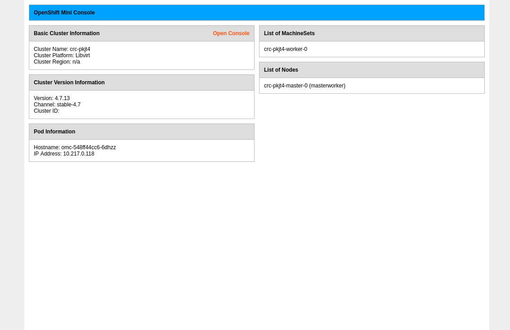

# Routes

## Overview

A single OpenShift cluster can run a multitude of different applications at
once. Some applications may only need to be used by other applications running
internal to the cluster, where an OpenShift [Service](services.md) object can be used to facilitate communication between those applications. Other applications may
need to be accessed to clients that are external to the cluster, maybe from
the Internet or a separate part of your corporate network. To support external
access to applications running in OpenShift, an object of kind `Route` can be
leveraged.

OpenShift ships with a router, based off of the popular open-source project 
HAProxy. The router examines HTTP headers for traffic coming
in, and uses that information to determine where to route requests. It provides
many features such as load-balancing, TLS termination, and path-based routing, to
name a few.

Before you begin, apply the manifest with the command below to set up some prerequisites we
need for this exercise.

```bash
$ oc create -f https://raw.githubusercontent.com/pumphouse-p/lnl-intro-to-openshift/main/manifests/services/prereqs.yaml
$ oc create -f https://raw.githubusercontent.com/pumphouse-p/lnl-intro-to-openshift/main/manifests/services/omc-deploy.yaml
$ oc create -f https://raw.githubusercontent.com/pumphouse-p/lnl-intro-to-openshift/main/manifests/services/omc-svc.yaml
```

> ⚠️ You can safely ignore any errors stating these resources already exist.

Switch to the `omc` project:

```bash
$ oc project omc
```

Review the manifest for the Route we will create to access our application from outside
of the OpenShift cluster.

```bash
$ curl https://raw.githubusercontent.com/pumphouse-p/lnl-intro-to-openshift/main/manifests/routes/omc-route.yaml; echo
```
```yaml
apiVersion: route.openshift.io/v1
kind: Route
metadata:
  name: omc
  namespace: omc
  labels:
    app: omc
spec:
  port:
    targetPort: http
  to:
    kind: Service
    name: openshift-mini-console
    weight: 100   
```

Create the Route:

```bash
$ oc create -f https://raw.githubusercontent.com/pumphouse-p/lnl-intro-to-openshift/main/manifests/routes/omc-route.yaml
```

Confirm the Route was created:

```bash
$ oc get routes
```
```
NAME   HOST/PORT                                                PATH   SERVICES                 PORT   TERMINATION   WILDCARD
omc    omc-omc.2886795277-80-elsy07.environments.katacoda.com          openshift-mini-console   http                 None
```

Note the column with the header of `HOST/PORT`. We can use the generated DNS record to
access the application.

> ⚠️ The DNS record above is only an example, be sure to use the value you see in your environment!

In a new browser tab, open the value you were given for the Route under the `HOST/PORT` column. You should see a simple landing page similar to the screenshot below.

